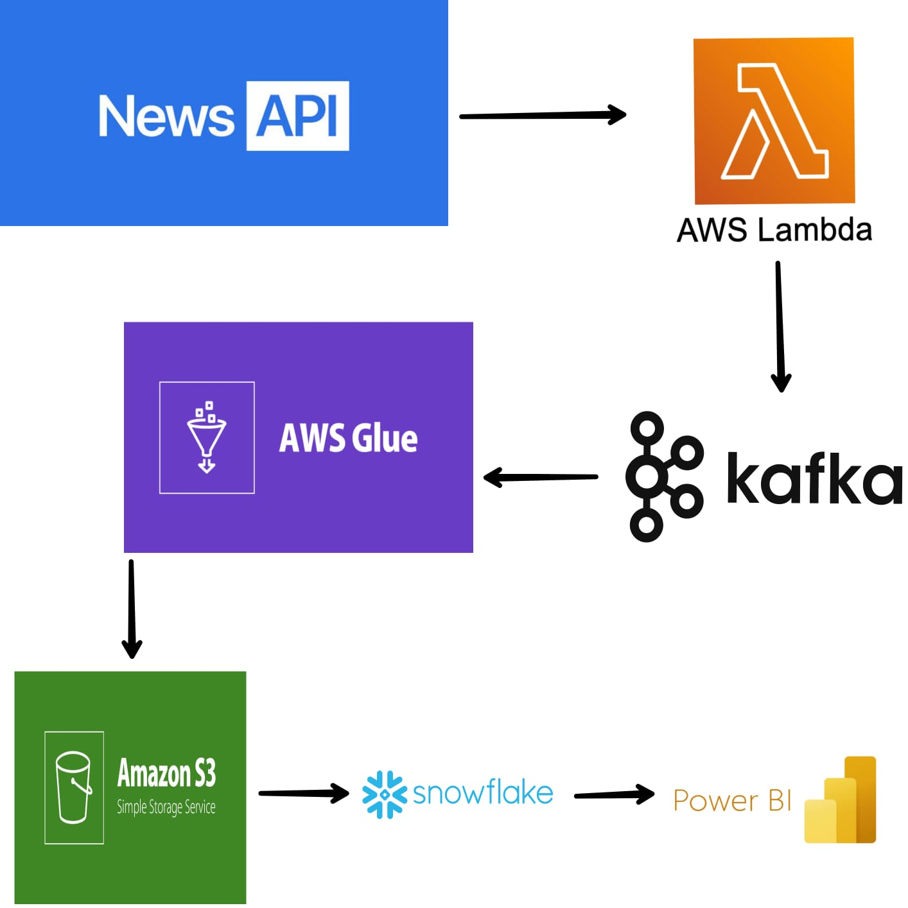

# 📰 News Sentiment Analysis

This project extracts real-time U.S. news headlines using the News API, performs sentiment analysis using AWS Glue, and visualizes the results in Power BI.

## 🔧 Technologies Used

 AWS Lambda, 
 Kafka (on EC2), 
 AWS Glue, 
 Amazon S3, 
 Snowflake, 
 Power BI

 ## 🔄 Data Pipeline Flow

1. Lambda fetches news from News API.
2. Sends data to Kafka hosted on EC2 (port 9092).
3. AWS Glue streaming job reads from Kafka.
4. Performs sentiment analysis on article content.
5. Stores results in Amazon S3 (CSV format).
6. Snowflake task loads data from S3.
7. Power BI visualizes the data directly from Snowflake.

## 🧠 Sentiment Score Interpretation

The sentiment score is calculated using TextBlob's polarity, which ranges from -1.0 to 1.0:

- Scores closer to 1.0 indicate positive sentiment.
- Scores closer to -1.0 indicate negative sentiment.
- Scores around 0 indicate neutral sentiment.

Example thresholds used:

- Positive: score > 0.1
- Neutral: -0.1 ≤ score ≤ 0.1
- Negative: score < -0.1

  
## 📊 Example Output

| Headline                                | Sentiment Score |
|-----------------------------------------|------------------|
| "Market rebounds as inflation eases"    | 0.76             |
| "Unemployment rates remain unchanged"   | 0.04             |
| "Political unrest disrupts local trade" | -0.62            |

## 📂 Project Files

- [my_lambda.py](my_lambda.py) — AWS Lambda function code that fetches news from the News API and pushes data to Kafka on EC2.
- [my_glue.py](my_glue.py) — AWS Glue script that reads news data from Kafka, performs sentiment analysis, and writes results to S3.
- [my_snowflake.sql](my_snowflake.sql) — SQL script used to create tables and load data into Snowflake from S3.

## ⚙️ Configuration Setup

Before running the project, make sure to configure the following:

- *AWS Credentials:*
  - AWS_ACCESS_KEY_ID — Your AWS Access Key ID
  - AWS_SECRET_ACCESS_KEY — Your AWS Secret Access Key
  - These credentials are needed for AWS Lambda, Glue, and S3 access.

- *AWS Lambda Environment Variables:*
  - NEWS_API_KEY — Your News API key to fetch news data.
  - KAFKA_BROKER — Kafka broker address (e.g., ec2-public-ip:9092).

   - *AWS Glue:*
  - Ensure the Glue job has the correct IAM role permissions to read from Kafka and write to S3.
  - - Configure the Glue job as a *streaming job* to continuously process incoming Kafka data.
  - Upload the required *JAR dependencies* to an S3 bucket, then reference their paths in the job configuration under --extra-jars. Example JARs include:
    - spark-sql-kafka-0-10_2.12.jar
    - kafka-clients.jar
    - Any other compatible Kafka and Spark JARs for your Glue version.
  - Add the JAR S3 path like this in the job’s parameters:
 - *Snowflake:*
  - Configure Snowflake connection parameters (username, password, account, warehouse, database, schema).
  - Set up a Snowflake task to load data from S3 every 5 minutes.

- *Power BI:*
  - Connect Power BI to your Snowflake data warehouse.
  - (Note: Power BI refresh is manual.)
 
  - *EC2 Instance (Kafka Broker):*
  - Kafka is hosted on an EC2 instance.
  - Make sure:
    - Kafka is installed and running on *port 9092*.
    - EC2 security group allows *inbound TCP traffic on port 9092*.
    - Kafka is configured to advertise the *public IP address*.
   
   - *Automation Triggers:*
  - *Lambda Trigger: Create a CloudWatch EventBridge rule to trigger the Lambda function every **15 minutes*.
  - *Snowflake Task: Set up to run every **5 minutes* to load newly arrived S3 data.
  - *Glue Streaming Job*: Automatically picks up new Kafka data as it arrives.

    
 - ## ⚠️ Security Notice

> ⚠️ *Warning*  
> Do *not* expose or commit your *AWS credentials, **Snowflake credentials, or **API keys* to any public repositories.  
> Always use *environment variables, **AWS Secrets Manager*, or other secure methods to store sensitive information.

- ## Architecture Diagram

## 🧾 Conclusion

This project showcases an automated and scalable data pipeline for news sentiment analysis using AWS services and Snowflake. It efficiently collects news data from the News API, streams it through Kafka hosted on EC2, processes it with AWS Glue, and stores the results in S3 and Snowflake. The sentiment scores provide valuable insights visualized in Power BI. Automation with Lambda triggers and scheduled Snowflake tasks ensures continuous and timely data updates. This setup highlights how to build an integrated, real-time analytics workflow in the cloud.     
